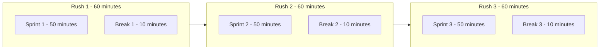

# Sprinter : Minimalist Pomodoro For Linux

## What is Sprinter ?

This is a simple, yet efficient, script that help you to use Pomodoro technique directly on your computer. With no more need to use your smartphone, you get a knew way to deep work while avoiding those tempting social medias.

## How to use it ?

Developped with minimalism in mind, such is the way to use it :

```bash
./splinter.sh <time_in_minutes> <time_in_minutes> <number_of_rushes>
```

If you want to make 3 rushes of 50 minutes of work, 10 minutes break, the command will be :

```bash
./splinter.sh 50 10 5
```

> By default, it's set to 4 rushes of 20 minutes of work and 5 minutes break.

Which leads us to :



In this exemple, you work 2h30 out of 3h chunk so you deep work for 83% of the given time.

## Future features

- #001 : Implementing long break between large chunks of rushes